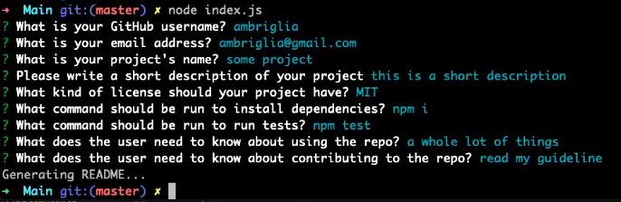

  # readme-autogen<br>
  [](https://opensource.org/licenses/MIT)<br>
  ## Description<br>
  answer questions<br>
  ## Table of Contents<br>
  [Installation](#idInstall)<br>
  [Usage](#idUsage)<br>
  [Contributing](#idContributing)<br>
  [Tests](#idTests)<br>
  [Questions](#idQuestions)<br>
  [License](#idLicense)<br>

  <a id="idInstall"></a>
  ## Installation<br>
  ```npm i```<br>
 
  <a id="idUsage"></a>
  ## Usage<br>
  node index<br>
  <br>
  <br>

  <a id="idContributing"></a>
  ## Contributing
  send me email for guidelines

  <a id="idTests"></a>
  ## Tests
  ```npm test```

  <a id="idQuestions"></a>
  ## Questions
  If you have any questions about the repo, open an issue or contact me directly at wtpate69@hotmail.com. You can find more of my work at GitHub username minprocess.

  <a id="idLicense"></a>
  ## License
  undefined
